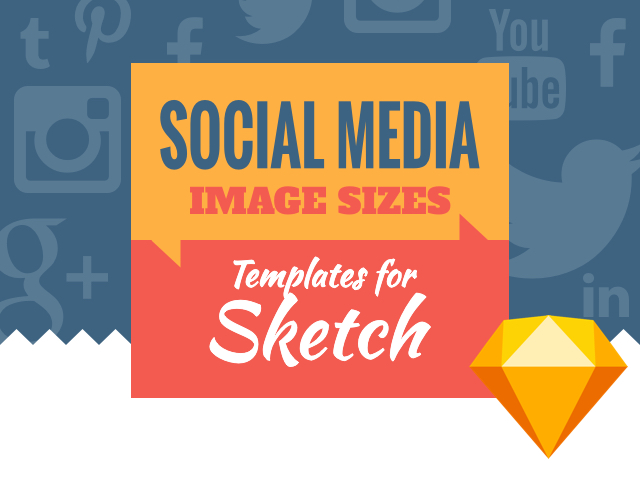
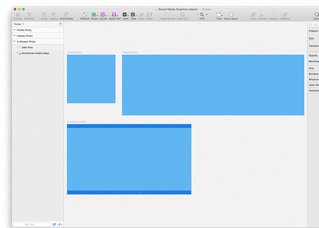

# Social Media Graphic Templates for Sketch

 

Artboards pre-sized as templates for various social media profiles and feed graphics, ready for use in Sketch for your graphic designing pleasure. Includes safe viewable areas for images that display differently on different devices.

**NEW:** Google My Business [Post](https://smallbusiness.googleblog.com/2017/06/make-your-business-stand-out-on-google.html) Images

 

Currently contains pages for Twitter, Facebook, Google My Business, Google+, Pinterest, LinkedIn, Tumblr, Instagram, and YouTube. Pull requests for other sizes/ networks are welcome!

## Additional reference sources
* [Sprout Social](http://sproutsocial.com/insights/social-media-image-sizes-guide/)
* [Canva](https://designschool.canva.com/blog/social-media-image-size/)

## Changelog
* 1.1.4 Updated Google My Business images for the new [Posts feature](https://smallbusiness.googleblog.com/2017/06/make-your-business-stand-out-on-google.html)
* 1.1.3 Added Google My Business.
* 1.1.2 Updated Linkedin.
* 1.1.1 Added Google Display Ads.
* 1.1 Added Tumblr, Instagram, and YouTube. Gave all  artboards official brand color background colors. Added safe area size info.
* 1.0 Forked from [Zoe Rooney](http://zoerooney.com)

License
------------
[WTFPL](http://www.wtfpl.net/)
